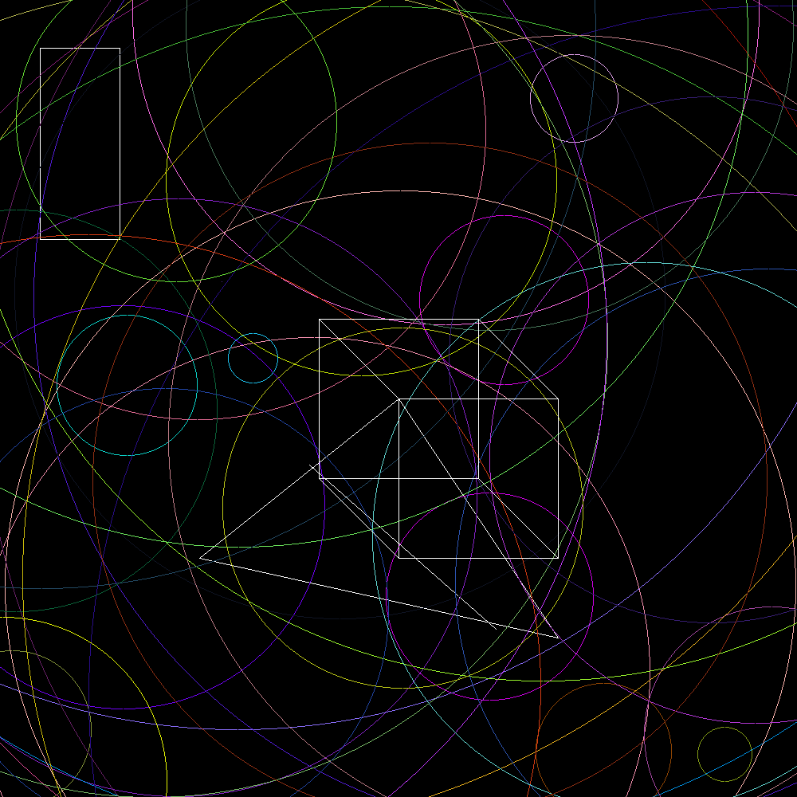
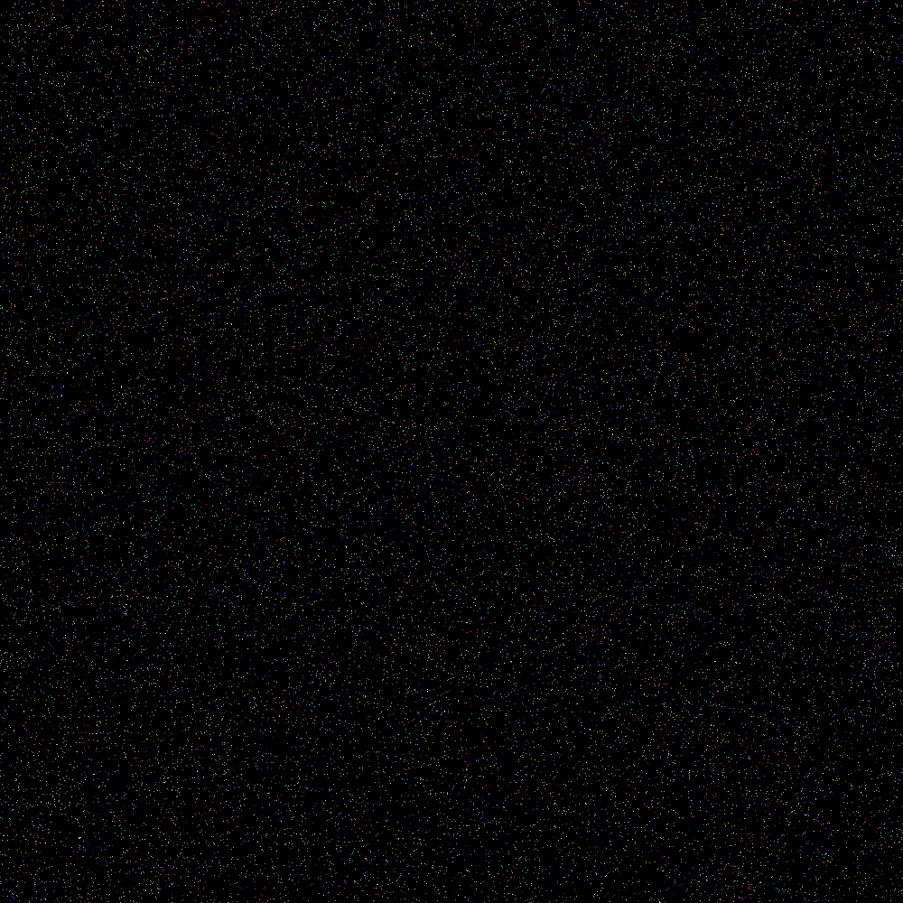
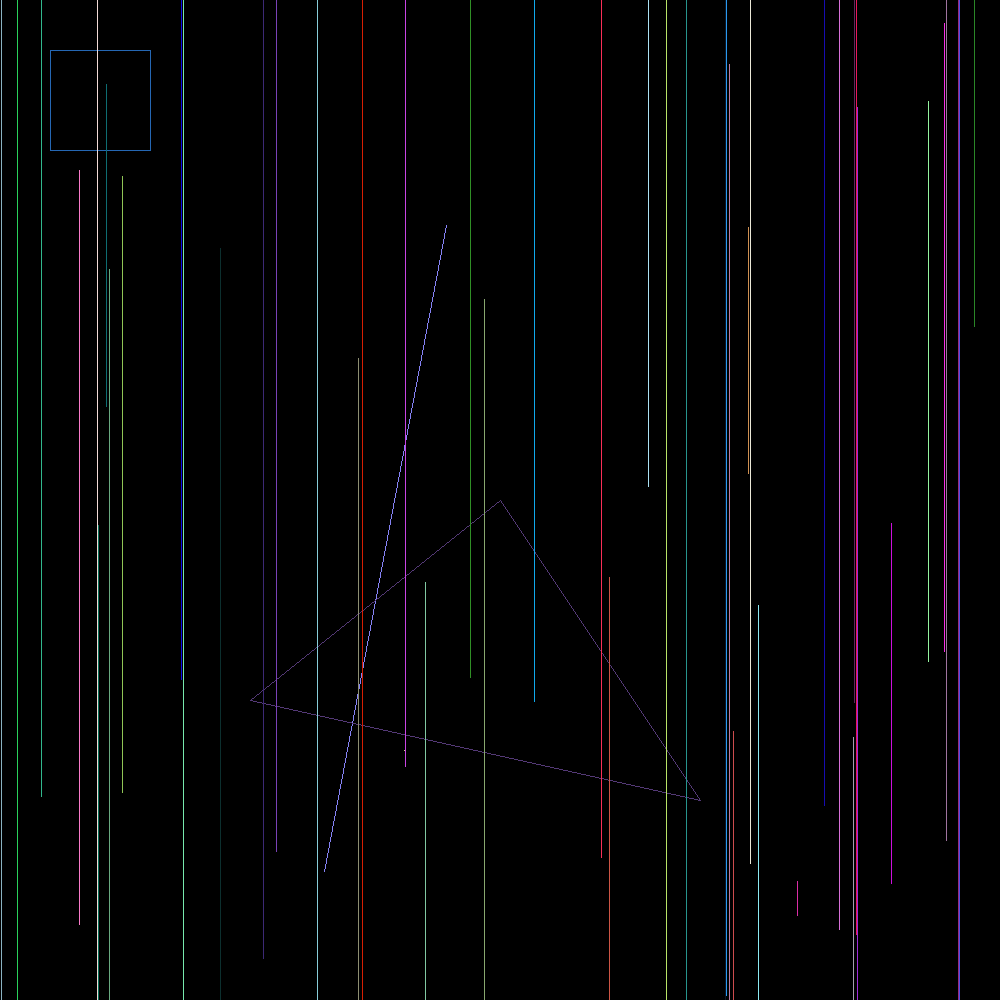
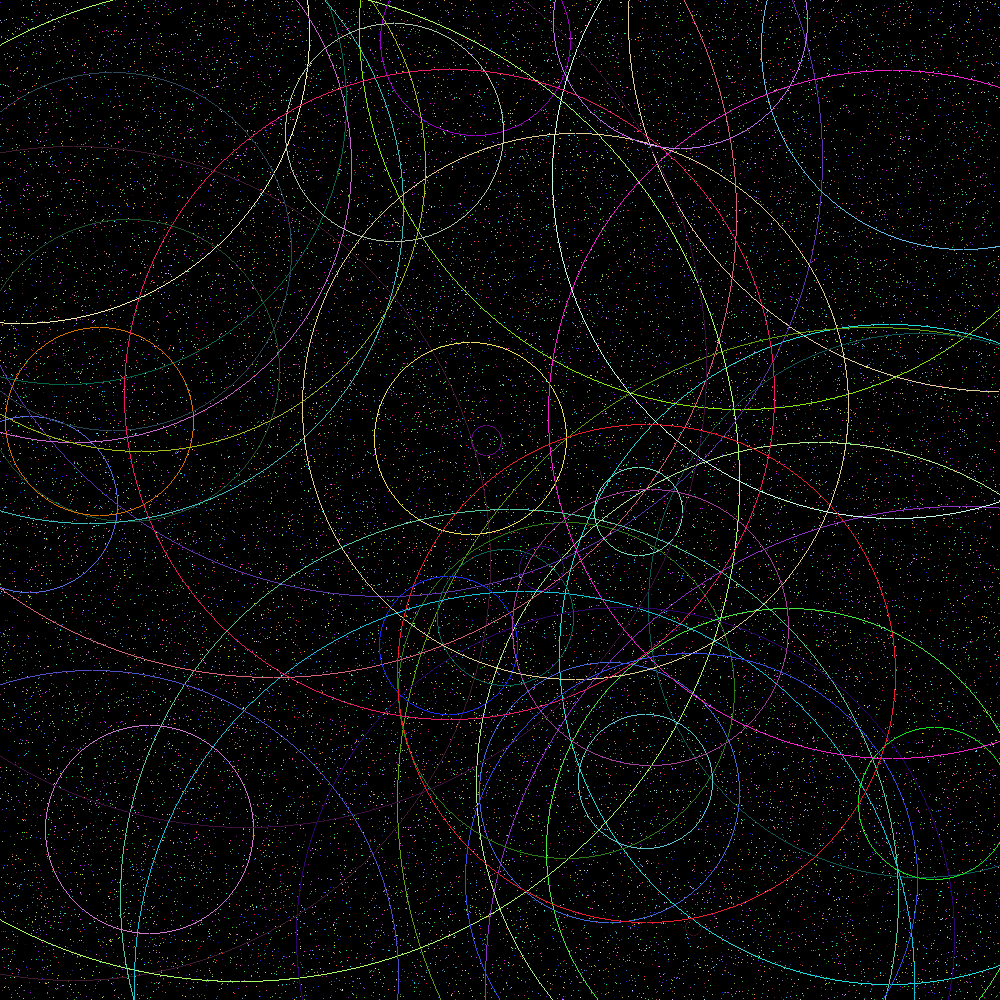
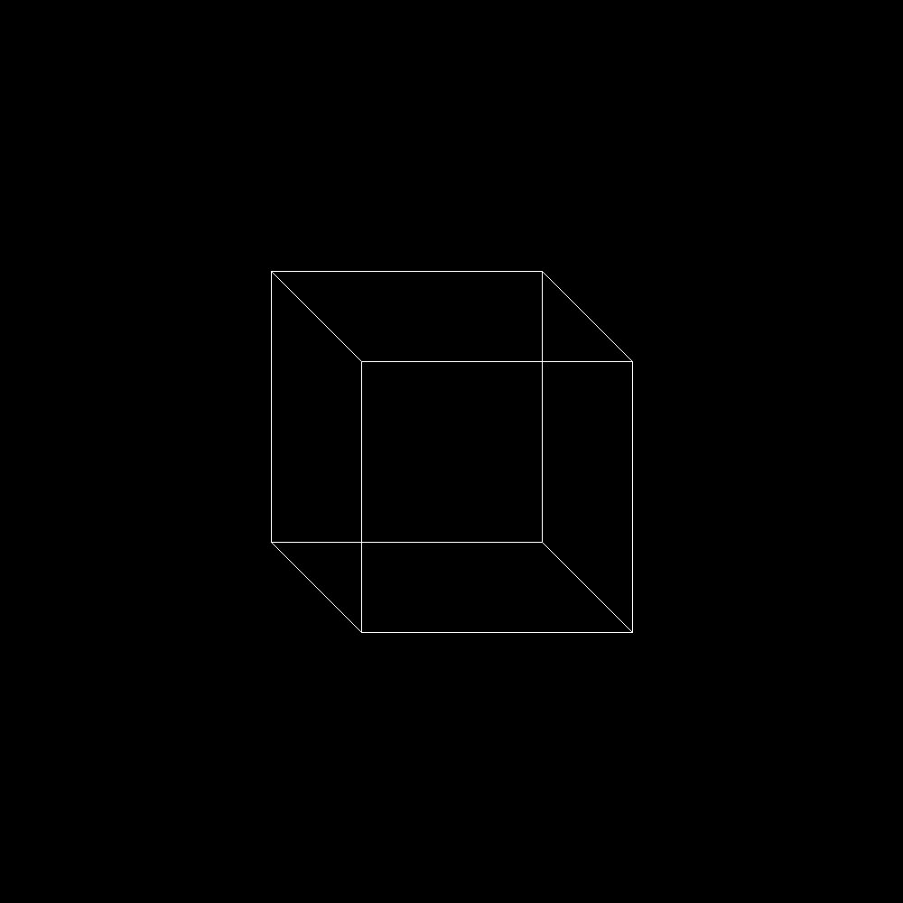

# Rust Geometric Drawing Library

## Overview

This project is a Rust library for drawing various geometric shapes on a raster image. The implementation uses a trait-based system for shape rendering with a clever design that separates drawing behavior from display logic.

## Core Concepts

### Traits

The library is built around two key traits:

1. **Drawable** - Defines how shapes are drawn on an image
   - Provides default implementation for random color generation
   - Each shape implements its own draw method

2. **Displayable** - Abstracts the actual pixel-setting operation
   - Allows separation between drawing logic and the display medium
   - Makes the library adaptable to different output types

### Shapes

The library includes implementations for the following shapes:

**Points**: The simplest geometric element, a single pixel on the screen. Points can be created with specific coordinates or randomly generated within image bounds.

**Lines**: Connect two points with a line-drawing algorithm that ensures smooth lines are drawn between any two arbitrary points, handling all edge cases.

**Circles**: Defined by a center point and radius. The implementation uses a sophisticated algorithm to approximate a circle on a pixel grid, optimizing for visual smoothness.

**Triangles**: Created from three points. The implementation draws three lines connecting the points to form a triangle.

**Rectangles**: Defined by two opposite corners. The implementation draws four lines to form a rectangle aligned with the coordinate axes.

**Cubes**: Created from two rectangles representing the front and back faces, with connecting lines to create a 3D perspective.

## Technical Highlights

- **Efficient Line Drawing**: A custom algorithm that determines the most appropriate pixels to light up
- **Random Shape Generation**: Support for creating random instances of each shape type
- **Color Management**: Automatic random color generation for visual variety
- **Boundary Checking**: Safe pixel plotting that respects image boundaries
- **Modular Design**: Clean separation of concerns with traits and structs

## Applications

This library can be used for:

- Education: Demonstrating basic computer graphics concepts
- Visualization: Creating simple geometric visualizations
- Art Generation: Producing abstract geometric art
- Game Development: Building simple 2D graphics engines

## Dependencies

- `raster` - For image manipulation and saving
- `rand` - For random number generation

## License

MIT