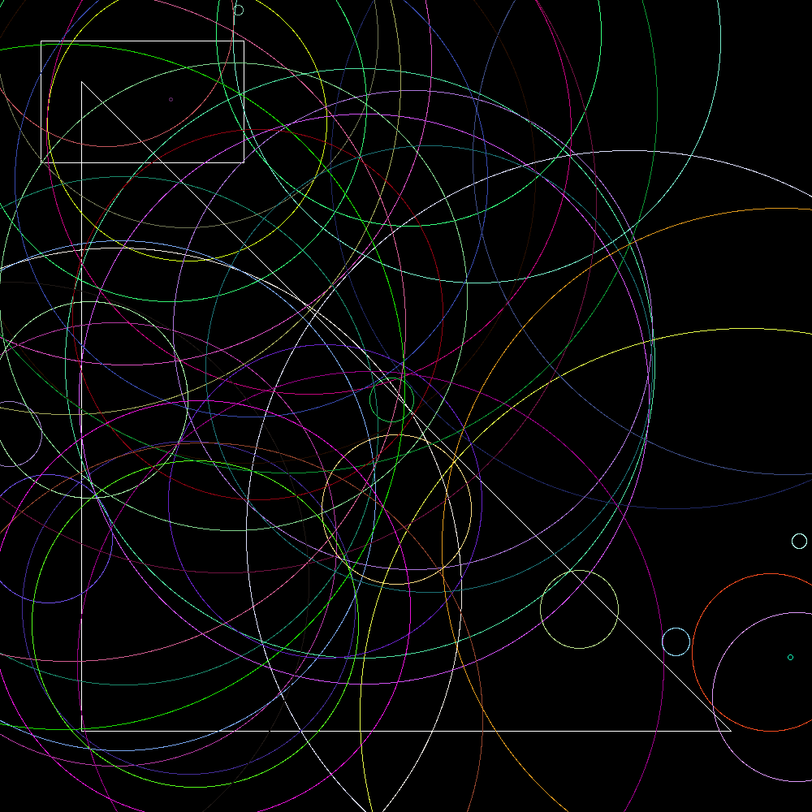

# Geometrical Shapes Project

A Java-based project for creating, drawing, and displaying various geometrical shapes using Java AWT graphics.

## Project Structure

```
│
├── geometrical_shapes/
│   ├── Circle.java          # Circle shape implementation
│   ├── Image.java           # Image handling utilities
│   ├── Line.java            # Line shape implementation
│   ├── Point.java           # Point shape implementation
│   ├── Rectangle.java       # Rectangle shape implementation
│   └── Triangle.java        # Triangle shape implementation
├── helpers/
│   ├── RandomNumber.java    # Random number generation utilities
│   └── Utils.java           # General utility functions
├── intarfaces/
│   ├── Displayable.java     # Interface for displayable objects
│   └── Drawable.java        # Interface for drawable objects
├── demo.png                 # Demo output image
├── image.png                # Generated output image file
├── Main.java                # Main application entry point
└── README.md                # Project documentation
```

## Features

- **Shape Creation**: Support for creating Points, Lines, Triangles, Rectangles, and Circles
- **Drawing Interface**: All shapes implement the `Drawable` interface with drawing capabilities
- **Display Interface**: Shapes implement the `Displayable` interface for rendering and saving
- **Random Generation**: Built-in random shape generation for Points, Lines, and Circles
- **Image Output**: Ability to save rendered shapes as PNG images

## Interfaces

### Drawable Interface
Contains methods for shape rendering:
- `draw()` - Renders the shape
- `getColor()` - Returns the shape's color

### Displayable Interface
Contains methods for shape display and persistence:
- `display()` - Shows the shape on screen
- `save()` - Saves the shape to a file

## Shape Classes

### Point
- **Constructor**: `Point(int x, int y)`
- **Static Method**: `random()` - Generates a random point
- Represents a single coordinate point in 2D space

### Line
- **Constructor**: `Line(Point start, Point end)`
- **Static Method**: `random()` - Generates a random line
- Connects two points with a straight line

### Triangle
- **Constructor**: `Triangle(Point p1, Point p2, Point p3)`
- Creates a triangle from three corner points

### Rectangle
- **Constructor**: `Rectangle(Point topLeft, Point bottomRight)`
- Creates a rectangle from two diagonal corner points

### Circle
- **Constructor**: `Circle(Point center, int radius)`
- **Static Method**: `random()` - Generates a random circle
- Creates a circle with specified center point and radius

## Getting Started

### Prerequisites
- Java Development Kit (JDK) 8 or higher
- Java AWT library (included in standard JDK)

### Compilation
```bash
javac *.java -d build
```

This command compiles all Java source files and places the compiled `.class` files in the `build` directory, maintaining the package structure.

### Running the Application
```bash
java -cp build Main
```

The `-cp build` flag sets the classpath to the build directory where the compiled classes are located.

## Usage Example

```java
// Create shapes
Point p1 = new Point(10, 20);
Point p2 = new Point(50, 80);
Line line = new Line(p1, p2);

// Create random shapes
Point randomPoint = Point.random();
Line randomLine = Line.random();
Circle randomCircle = Circle.random();

```

## Helper Classes

### RandomNumber
Provides utility methods for generating random numbers used in shape creation.

### Utils
Contains general utility functions used throughout the project.

### Image
Handles image processing and file operations for saving rendered shapes.

## Output




## Contributing

When adding new shapes:
1. Implement both `Drawable` and `Displayable` interfaces
2. Provide appropriate constructor as specified
3. Add random generation method if applicable
4. Update this README with new shape documentation
